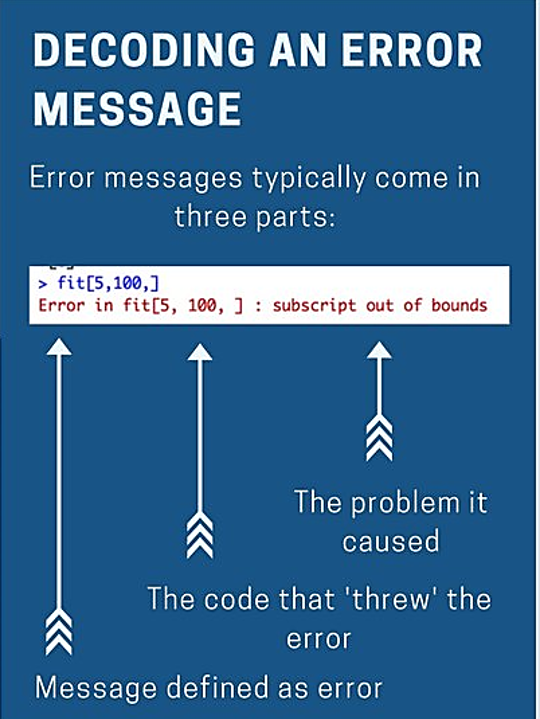
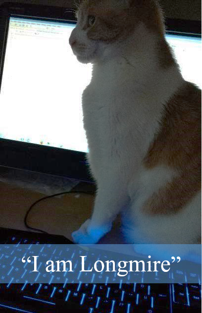

```{r setup, include=FALSE}
library("rmarkdown")
knitr::opts_chunk$set(echo = TRUE, error = TRUE)
htmltools::tagList(rmarkdown::html_dependency_font_awesome())
```


### Good morning, Detective! {-}

<br>

__Please connect to your computer__

1. __Open__ the Start menu  \ \*_Click the Window’s logo on the bottom left of the screen_
1. Select ` Remote Desktop Connection `
1. Enter ` w7-your7digit# `
1. Press _Connect_
1. Relax...

<br>

<p style="display:block; text-align:center;"></p>

<br><br><br>


# Welcome to R Camp! {-}
<hr>


<br>

We are __Kristie__, __Dorian__, and __Derek__.   

We like __R__.

We are not computer scientists. 

Sometimes we mistakes. You will see us make mistakes. Feel free to laugh. It's okay. Really.


<br><br>


### Who are you? {-}

<br>

#### You are the great cohort of &nbsp; <span style="font-size: 1.8em;"><i class="fa fa-group" aria-hidden="true" style="color: steelblue;"></i></span> <span style="font-size: 2.7em;">2018</span><span style="font-size: 2em;"><i class="fa fa-group" aria-hidden="true" style="color: steelblue;"></i></span> {-}


```{r, include=F, eval=F}
library("yarrr")
library("wordcloud")
library("wordcloud2")
library("dplyr")

set.seed(2)

names <- c("Derek", "Kristie", "Hassan", "Lisa", "Timothy", "Kellie", "Michaela", "Jacobe", "Jeffrey", "Megan", "Laura", "Erik", "Nicholas", "Ashley", "Dorian")

names <- c("Derek", "Hassan", "Lisa", "Timothy", "Kellie", "Michaela", "Jacobe", "Jeffrey", "Megan", "Laura", "Erik", "Nicholas", "Ashley", "BlueBeard", "R","RCamp","2018")


names <- c("Helen", "Dorian", "Derek","Jeffrey", "Megan", "Laura", "Anne", "Kristie", "Ashley", "Steve", "Bunny", "R","Maps","Eggs","2018")

frequency <- c(c(1,1, 1, 1, 1, 1, 1, 1, 1, 1,1 ,1 ,1, 1)*8, 14,10,11)

frequency <- c(as.numeric(sample(8:12, 11, replace = T)), 24,14,14,18)

pirates <- piratepal("info2") 

wordcloud(names, 
          random.order = F, 
          random.color = TRUE, 
          scale        = c(4,1), 
          freq         = frequency, 
          colors       = pirates, 
          vfont        = c("sans serif","bold"), 
          rot.per      = 0.2,
          size         = 0.1)

wordcloud2(data.frame(word = names, freq = frequency), size = 1, color = 'random-dark')

#letterCloud(data.frame(word = names, freq = frequency), word = "R", color = 'random-light', wordSize = 10)

```

{widht=70%}

<br>

You are the all in this together. Use each other as a resource. Share ideas, share code, collaborate. Make bad R jokes.   
<br>

__Here's one:__  _What 'tis the pirate's favorite letter?_

<br>

{width="230"}

<br>

> _Just kidding. You'd think it'd be R, but 'tis the __C__ they truly love._


<br>


### <i class="fa fa-exclamation-triangle" aria-hidden="true" style="color:orange;"></i> Disclaimer {-}

Spelling is very important in R.

<br>


_The Official Guide to spelling lightning._

<br>

> We don't know everything.    
> Actually, we just learned how to spell lightening storm.   
> Ahem, I mean __lightning__ storm. 

<br>


### LET'S GO! {-}

#| New project
<hr>

Okay detective, let's open a new dossier for today's mystery. 

<br>

__Step 1:__ Start a new project

- In _Rstudio_ select _File_ from the top menu bar
- Choose _New Project..._
- Choose _New Directory_
- Choose _New Project_
- Enter a project name such as `"cat_mystery"`
- Select _Browse..._ and choose a folder where you normally perform your work. 
- Click _Create Project_


## New R script

R "scripts" are where you write your R code and document your work. They're like recipes or prescriptions you write the tell the computer what you want to happen to your data.

__Step 2:__ Open a new R script

- In the upper left, click on the white file icon with the green (+) sign. 
- Select _R Script_.

{width=450}

<br>

__Save script__

- Click on the floppy disk icon
- Enter a file name such as `cat_code.R`


## A tour of R Studio


<br>

__1. Code editor__ 

This is where you write your scripts and document your work. The tabs at the top of the code editor allow you to view scripts and data sets you have open. This is where you'll spend most of your time.
 
__2. Console__ 

This is where code is actually executed by the computer. It shows code that you have run and any errors, warnings, or other messages resulting from that code. You can input code directly into the console and run it, but it won't be saved for later. That's why we like to run all of our code directly from a script in the code editor.
 
__3. Workspace__ 

This pane shows all of the objects and functions that you have created, as well as a history of the code you have run during your current session. The environment tab shows all of your objects and functions. The history tab shows the code you have run. Note the _broom_ icon below the Connections tab. This cleans shop and allows you to clear all of the objects in your workspace.
 
__4. Plots and files__ 

These tabs allows you to view and open files in your current directory, view plots and other visual objects like maps, view your installed packages and their functions, and access the help window. If at anytime you're unsure what a function or package does, enter the name of thing after a question mark. For example, try entering `?mean` into the console and push __ENTER__.


## Make it your own

Let's add a little style so we feel more at home. Follow these steps to change the font-size and and color scheme: 

1. Go to __Tools__ on the top navigation bar. 
2. Choose `Global Options...`
3. Choose `Appearance` with the paint bucket.
4. Find something you like.

<br>


{width="420" style="margin-left:20px;"}


#| First steps
<hr>

You can create objects and assign values to them using the "left arrow" `<- `, more officially known as the assignment operator. Try adding the code below to your R script and creating an object called `name`.

Once you add the code to your script, you can run the code by moving the blinking cursor to that line and pressing __CTRL + ENTER__.
```{r steps, eval = F}

# Create a new object
cat <- "Derek"

cat


# When saving text to a character object you need quotation marks.
# This won't work.
cat <- Derek


# Without quotes, R looks for an object called Derek, and then let you know that it couldn't find one. 


# You can copy an object by saving it to a new name.
cat2 <- cat2


# Overwrite an object
cat <- "Derek II"
  
cat


# Did name2 change as well?
cat2  

```


<br>

If you create a name you don't like you can drop it with the function `rm() `.
```{r, eval = F}

# Delete objects to clean-up your environment
rm(cat)

rm(cat2)


# Now, how do I get the 'cat' object back?


```

<br>


<div class="tip">

__HOORAY!__  Don't worry about deleting data or making a mistake in R. When you load data files into R it only copies the contents. That means all your original data files will remain safe and won't suffer from any accidental changes. If anything disappears or goes wrong in R, it's okay! You can always re-load the data using your script. No more worries about whether you remembered to save the latest data file or not.
</div>

<br>


## Give it a name

Everything has a name in R and you can name things almost anything you like. You can even name your data `TOP_SECRET_Shhhhhh...` or `unicorn_sightings` or `the_worst_data_ever`.

Sadly, there are a _few_ minor restrictions. Object names can't include spaces or special characters such as a `+`, `-`, `*`, `\`, `/`, `=`, `!`, or `)`. However, on the plus side object names can include a `_`.

<br>

__Your turn!__
_Try running some of these examples in your R console._
```{r, eval = F}

n cats <- 5

n*cats <- 5

n_cats <- 5

n.cats <- 5


all_the_cats! <- "A very a big number"


# You can add one cat
n_cats <- n_cats + 1


# But what if you have 10,000 cats?
n_cats <- 10,000


# They also cannot begin with a number.
1st_cat <- "Fluffer Puff"

# But they can contain numbers.
cat1    <- "Fluffer Puff"


```
<br>


> __NOTE:__  What happened when you created `n_cats` the second time?
>
> When you create a new object that has the same name as something that already exists, the new object will replace the old one. Sometimes you'll want to update an existing object and replace the old version. Other times you may want to copy an object to a new name to preserve the original. This is similar to choosing between _Save_ and _Save As_ when you save a file.


## Multiple items
<hr>

You can put multiple values inside `c()` to make a vector of items. Each additional item is separated by a comma. The `c` stands for to conCATenate or to combine values.
  
Let's use `c()` to create a few vectors of cat names and their ages.

```{r vectors}

# Create a character vector and name it cat_names
cat_names <- c("Fluffy", "Longmire", "Lucy")

# Print cat_names to the console
cat_names

# Create a numeric vector and name it cat_ages
cat_ages  <- c(3,7,14.5)

# Print cat_ages to the console
cat_ages
```


## Make a table

A table in R is known as a __data frame__. Data frames have columns of data, each made from a named vector. Let's make a data frame with two columns by using the cat names and ages from above.

```{r table}

# Create table with columns "names" and "ages" with values from the cat_names and cat_ages vectors
cat_df <- data.frame(names = cat_names,
                     ages  = cat_ages)

# Print the cat_df data frame to the console
cat_df

```


<br>

To see the values in one of your columns, use the `$` sign after the name of your table.

```{r columns}

# Print the "ages" column in cat_df
cat_df$ages

```


<div class="quiz">
### Pop Quiz, hotshot! {-}

__Which of these names are valid for a new object? (Hint: You are allowed to test them.)__

<input type="radio"> _my cat fred_ <br> 
<input type="radio"> _my_CAT55_    <br> 
<input type="radio"> _5cats_       <br> 
<input type="radio"> _my-cat_      <br> 
<input type="radio"> _Whatever!_   <br>

<br>
<div class="toggle"><button class = "btn_code">_Show solution_</button>
<br>

<i class="fa fa-check" aria-hidden="true" style="color: green;"></i> `my_CAT55`  

_Yes!! That was purrfect!_

</div></div>


## Leave a #comment

You may have noticed the text in the scripts with the `#` in front. These are called comments. Any line that starts with a `#` won't be executed as R code. You can use the # to add notes in your script to make it easier for others and yourself to understand what is happening and why. You can also use comments to add warnings or instructions for others, add references to data you're using, or point out things that need to be looked into further.


## Functions

{align="right" width="280" style="margin-left:25px; margin-bottom: 60px;"}

Now that you know what objects are and how to create them, let's learn how to use them. Functions take one or more inputs called "arguments". They perform steps based on the arguments and usually return an output object. 

<br>

You can think of a function like ordering pizza.

```{r, eval=F} 

order_pizza(address  = "140 3rd place, Bingo MN", 
            toppings = c("mouse whiskers", "catnip", "anchovies"), 
            time     = "ASAP")

```

<br>

The function above calls a pizza place and provides several arguments (your address, pizza toppings, and delivery time). With some luck, the function will sucessfully return a new object (your cat's favorite pizza). Note that when you have more than one argument, you will use a comma to separate them.


### Mean age {-}

We already covered two functions: `c()` and `data.frame()`. Now let's use the `mean()` function to find the average age of our cats.
```{r}

# Call the mean function with cat_ages as input
cat_ages_mean <- mean(cat_ages) # Assigns the output to cat_ages_mean

# Print the cat_ages_mean value to the console
cat_ages_mean

```

<br>

The `mean()` function takes the _cat_ages_ vector as input, performs some calculations, and returns a single numeric object. Note that we assigned the output object to the name `cat_ages_mean`. If you don't assign the output object it will be printed to the console and won't be saved. Sometimes this is okay, especially when you're still in the exploratory stages. 
```{r}
# Alternative without assigning output
mean(cat_ages) 

```

<br>

Note that our `cat_ages` vector has not changed at all. Each function has its own "environment", and all of its calculations happen inside its own bubble. Usually anything that happens inside a function won't change objects outside of the function's environment. 

```{r}

cat_ages

```

<br>


### Function summary {-}

There are functions in R that are more complex, but most boil down to the same general setup:

> new_output <- function(input1, input2)

You call the function with input arguments inside parentheses and get an output object in return. You can make your own functions in R and call them almost anything you like, even `my_amazing_cat_function()`. Naming rules for functions and arguments are the same as those for objects (no spaces or special characters like `+`, `-`, `*`, `/`, `\`, `=`, or `!` and they can't begin with a number, sorry).


<div class="quiz">
### Pop Quiz!   {-}

__Which of these is a valid function call?__

<input type="radio"> _lick("paws" "tail")_          <br> 
<input type="radio"> _scratch, "couch", "door"_     <br> 
<input type="radio"> _sleep(3, "hours")_            <br> 
<input type="radio"> _meow(until fed)_              <br> 
<input type="radio"> _shed(1 million, "hairs")_     <br>

<br>
<div class="toggle"><button class = "btn_code">_Show solution_</button>
<br>

<i class="fa fa-check" aria-hidden="true" style="color: green;"></i> `sleep(3, "hours")`  

_Correct! You're quite good at this._

</div></div>


#| Reading and loading data
<hr>


The first step of a good mystery is finding some clues. Here's an example data table showing my favorite cats. It is saved on the internet as an Excel file [here](https://raw.githubusercontent.com/MPCA-air/RCamp/master/data/my_cats.xlsx).

```{r ex-data1, echo=F, message=F, warning=F}
library("readr")
library("tibble")
library("knitr")

my_cats <- "Cat Name,Cat Age,Cat Color              
            Mr. Sauce,3,Salt-n-pepper        
            Sad Face,2,Tabby
            Noodles,6,Calico"

my_cats <- read_csv(my_cats)

#write.csv(my_cats, "X:/Agency_Files/Outcomes/Risk_Eval_Air_Mod/_Air_Risk_Evaluation/R/R_Camp/Intro to R/Exercises/RCamp/data/my_cats.csv", row.names = F)

kable(my_cats)
```

<br>

> __But how do we get this data into R?__


## CSV to the rescue 

The main data format in R is the __CSV__ _(comma-separated values)_. A __CSV__ is a simple text file that can be opened in R and most other stats software, including Excel.  

Here's how the example cat table looks when it is saved as a __.CSV__ file. 

__my_cats.csv__  

```
Cat Name,Cat Age,Cat Color  
Mr. Sauce,3,Salt-n-pepper  
Two Face,2,Tabby  
Noodles,6,Calico  
```

It looks squished together right now, but that's okay. When it's opened in R the text will become a familiar looking table with columns and rows.
  
<br>  

## Save Excel to CSV file

First, open the Excel cat table by copying this path into a new window or to the Windows search bar  - `X:\Agency_Files\Outcomes\Risk_Eval_Air_Mod\_Air_Risk_Evaluation\R\R_Camp\Student Folder\my_cats.xlsx`.


And then follow these instructions to save the Excel file as a _CSV_ file.

- Go to _File_  
- _Save As_  
- _Browse_ to your project folder  
- Create new "data" folder  
- Save as type: _CSV (Comma Delimited) (*.csv)_  
    - Any of the _CSV_ options will work    
- Click __Yes__      
- Close Excel (Click "Don't Save")   

<br>

Now let's check that it worked. Return to RStudio and open your new data folder by finding it in your _Files_ tab in the lower right window. Click on your _CSV_ file and choose __View File__.


## Read CSV into R

Copy the code below to your R script and run the line with the `read.csv` function (Hit __CTRL + ENTER__). It will return a nice cat data frame called `my_cats`. The character string `"data/my_cats.csv"` inside the parentheses of the `read.csv()` function is the path of the data file. 

```{r cat-csv}

read.csv("data/my_cats.csv")

```
<br>

__Note:__ The location of the CSV file above will only work if you have your project open. When your project is open, R sets the working directory automatically to your project folder. We will demonstrate reading a file directly from the X-drive a bit later.

<br>

## Name your table

If you want to work with the data in R, you will need to give it a name by using the assignment operator `<-`. 

Try the code below. 
```{r cat_csv_name}

my_cat_file <- "data/my_cats.csv"

my_cats <- read.csv(my_cat_file)

# Type the name of the table to view it in the console
my_cats

```


## Bonus

You can save the file path as an object, such as `cat_file <- "data/my_cats.csv"`. Then you can use that object as a shortcut to the location of your data.  Now when you want to load the cat table you can write `read.csv(cat_file)`. This handy trick will make it easier down the road when you want to update your code to use with new data.

```{r cat-csv2}

# Assign the file path character string as an object with the name cat_file.
cat_file <- "data/my_cats.csv"


# Use read.csv with the object cat_file which refers to "data/my_cats.csv"
read.csv(cat_file)

```


#| Add a new `package` &#x1F4E6;
<hr>

> __What is a package?__

A _package_ is a small add-on for R, like a phone App for your phone. They add capabilities like statistical functions, mapping powers, and special charts. In order to use a new package we first need to install it. 


## _readr_ 

{align="left" width="145" style="margin-right:18px;"}

<br>

The _readr_ package helps import data into R in different formats. It does extra work for you like cleaning the data of extra white space and formatting tricky dates. Your packages are stored in your R _library_. 

<br> <br>

__Add a package to your library__  

1. Open _RStudio_ 
1. Type ` install.packages("readr") ` in the lower left console
1. Press Enter
1. _Wait two seconds_
1. Open the `Packages` tab in the lower right window of RStudio to see the packages in your _library_
    - Use the search bar to find the `readr` package

<br>

The packages tab only shows the available packges that are installed. To use one of them, you will need to load it. Loading a package is like opening an App on your phone. To load a package we need to use the `library()` function. After loading the _readr_ package you will able to read the cat data with the shiny new function `read_csv() `. This function is 300% better than `read`.`csv()`. 

```{r cat-csv-readr}
library("readr")

my_cat_file <- "data/my_cats.csv"

read_csv(my_cat_file)
```

<br>


### <i class="fa fa-user-secret" aria-hidden="true" style="color:#040707;"></i> Pro-tip! {-}

You may have noticed the row of three letter abbreviations under the column names. These describe the data type of each column.

> `chr` stands for __character__ vector, or a string of characters. Examples: _"apple"_, _"apple5"_, _"5 red apples"_  
> `int` stands for __integer__. Examples: _5_, _34_, _1071_

We'll see more data types, such as `dates` and `logical`, in later lessons.


<div class="quiz">
### Pop Quiz! {-}

__What data type is the `Color` column?__

<input type="radio"> _letters_        <br> 
<input type="radio"> _character_      <br> 
<input type="radio"> _words_          <br> 
<input type="radio"> _numbers_        <br> 
<input type="radio"> _integer_        <br>

<br>

<div class="toggle"><button class = "btn_code">_Show solution_</button>

<br>

<i class="fa fa-check" aria-hidden="true" style="color: green;"></i> `character`  

```{r, echo=F, warning=F}
library("cowsay")

say(paste0("Meow! Not too shabby for a tabby."), "behindcat")
```

</div></div>


### Get help on functions

Let's look a bit closer at the `read_csv()` function.

```{r, eval = F}
read_csv(my_cat_file)

# Get help 
?read_csv
```

<br>


__Function arguments__

For `read_csv()`, the character object argument _my_cat_file_ is what the function uses to know where to find the data file to read. Funcitons often have more than one argument. Type `?read_csv` into your console to see help in the lower-right pane that describes all of the function's arguments and what they do. Many of the options have default arguments (such as `col_names = TRUE`), which the function will use if you don't provide an alternative argument. A short scroll down in the help window will show you more details about the arguments and the values they take.

> `function(arg1 = input1, arg2 = input2, arg3...)


The _file_ argument tells us that the function expects a path to a file. It can be many types of files, even a _ZIP_ file. Below that, you'll see the _col_names_ argument. This argument takes either `TRUE`, `FALSE`, or a character vector of column names. The default is `TRUE`, which means the first row in the CSV is used as the column names for your data. 


__Don't like the column names?__ We can give new column names to the _col_names_ argument like this:

```{r, message=F}
my_cat_file <- "data/my_cats.csv"

#Assign desired column names as a character vector named column_names
column_names <- c("Name", "Age", "Color")

read_csv(my_cat_file, column_names)
```

<br>

We now have the column names we want, but now the original column names in our CSV file show up as a row in our data. We want `read_csv` to ignore the first row. Let's look through the help window and try to find an argument that can help us. The `skip` argument looks like it could be helpful. Sure enough, the description is exactly what we're looking for here. The default is `skip = 0` (read every line), but we can skip the first line by providing `skip = 1`.

```{r}
column_names <- c("Name", "Age", "Color")

read_csv(my_cat_file, column_names, skip = 1)

```

<br>

__Success!__ 

You may be wondering why we included `skip =` for the skip argument, but only provided the objects for the other two arguments. When you pass inputs to a function, R will assume you've entered them in the same order that is shown on the ?help page. Let's say you had a function called `feed_pets()` with 3 arguments:

> `feed_pets(dogs = "dogfood", cats = "catnip", fish = "pellets")`.

A shorthand way to write this would be `feed_pets("dogfood", "catnip", "pellets")`. If we write `feed_pets("dogfood", "pellets", "catnip")`, the function will send _fish pellets_ to your cat and _catnip_ to your fish. No good. If you really wanted to write "pellets" second, you would need to tell R which food item belongs to each animal, such as `feed_pets("dogfood", fish = "pellets", cats = "catnip")`.

The same thing goes for `read_csv()`. In `read_csv(my_cat_file, column_names, skip = 1)`, R assumes the file is `my_cat_file` and that the col_names should be set to `column_names`. The `skip =` argument has to be included explicitly because _skip_ is the __10th__ argument in `read_csv()`. If we don't include `skip = `, R will assume the value we entered is meant for the function's __3rd__ argument. 

### <i class="fa fa-user-secret" aria-hidden="true" style="color:#040707;"></i> Pro-tip! {-}

A handy shortcut to see the arguments of a function is to enter the name of the function in the console and the first parenthesis, such as ` read_csv( `, and then hit `TAB` on the keyboard. This will bring up a drop-down menu of all the available arguments for that function.

<br>


__Key terms__  

`package` An add-on for R that contains new functions someone created to help you. It's like an App for R.  
`library` The name of the folder that stores all your packages, and the function used to load a package.


<div class="quiz">
### Pop Quiz!   {-}

<br>

__What package does `read_csv()` come from?__

<input type="radio"> _dinosaur_     <br> 
<input type="radio"> _get_data_     <br> 
<input type="radio"> _readr_        <br> 
<input type="radio"> _dplyr_        <br> 
<input type="radio"> _tidyr_        <br>

<br>
<div class="toggle"><button class = "btn_code">_Show solution_</button>
<br>

<i class="fa fa-check" aria-hidden="true" style="color: green;"></i> `readr`  

_Great job! You're fur real._

</div>

<br><br><br>

__How would you load the package `catfinder`?__

<input type="radio"> _catfinder()_            <br> 
<input type="radio"> _library("catfinder")_     <br> 
<input type="radio"> _load("catfinder")_        <br> 
<input type="radio"> _package("catfinder")_     <br> 

<br>
<div class="toggle"><button class = "btn_code">_Show solution_</button>
<br>

<i class="fa fa-check" aria-hidden="true" style="color: green;"></i> `library("catfinder")`  

_Excellent! Keep the streak going._

</div></div>


# Data exploration {-} 


#| Pet detective
<hr>


## _The case of the mopey cat_


On your way home from work you find a _wet_ and _mopey_ cat sitting on your front stoop. Oh my! It looks so sad, maybe you can bring it inside and give it a treat.   

When you pick up the cat you notice a collar with a __number__ on it. 

> _HINT: Your cat's tag number is the same as the last digit of your birthday. Weird coincidence right?_ 

This gives you an idea! Your friend recently mentioned a list that has all the missing cats people have reported in the city. Maybe you can use the tag number to help find the lost kitty's home.

<br>


## It's inspector time!

{align="right" width=250 style="-webkit-transform: scaleX(-1); transform: scaleX(-1); margin-right: 80px; margin-top: -10px"}

Let's get our script ready for some detective work. Since we bill by the hour we're going to be very thorough with our documentation.


__Script comments__

Add a brief description of your new case to the top of the script using the comment symbol `#`.

```{r comments}
# This file documents my search for the home of a lost cat I found this evening.

# What I know so far
animal  <- "cat"

tag_num <- 444

pet_detective <- "Agent Cooper"

# Next steps
# 1. Find the missing cat database.
# 2. Load the cat data.
#
```

<br>

Now let's find ourselves some clues.


#| All the cats!
<hr>

Thanks to your friend, you can download a list of all the missing cats in your town. Follow the steps below to read the cat data into R.  

## Find the file's location {-}

Open this URL in your browser https://github.com/MPCA-air/RCamp/tree/master/data, and find the file `missing_cat_list.csv`. To download, __Right click__ on your cat's file and select __Save Link As...__. Navigate to your project folder and save the file into a folder named `data\`. Don't have a `data` folder? Go ahead and create a new one.  


## Add the file location to your script {-}
Now you can paste the file's location into the `read_csv()` function. Here's a code snippet to get you started.

```{r snip1, eval = F}
library("readr")

# Replace the `...` with the name of the file
all_cats_file <- "data/..."


# Replace the `...` with 'all_cats_file'
all_cats <- read_csv(...)

```

<br>

<div class="toggle"><button class = "btn_code">_Show solution_</button>

<br>

```{r read-all-cats, warning = F}
library("readr")

all_cats_file <- "X:/Agency_Files/Outcomes/Risk_Eval_Air_Mod/_Air_Risk_Evaluation/R/R_Camp/Student Folder/missing_cat_list.csv"

all_cats  <- read_csv(all_cats_file)
```

</div>


<div class = "tip">

## Copy a file's location {-}

In _Windows_ there's a handy trick to copy the path to a file on your computer:

- Hold Shift + Right click on the file name. Select "Copy as path" from the menu.

</div>


### <i class="fa fa-user-secret" aria-hidden="true" style="color:#040707;"></i> Pro-tip! {-}

> File paths in R use forward slashes (`/`). In Windows you'll need to switch backslashes (`\`) to forward slashes (`/`). A file on your desktop located at `C:\Desktop\file.csv` would be read into R as `read_csv("C:/Desktop/file.csv")`
>  
> One trick to quickly fix a long path name is to press __CTRL + F__. Then you can use search tool to find any (`\`) and replace it with (`/`).


<br>


__NOTE:__ It's good practice to load the packages you will need at the top of your script. You will need to run these lines __every__ time you open R or switch projects. If you forget, you're likely to see this error message.

```{r, echo = F}

detach("package:readr", unload = TRUE)

```

```{r}

read_csv(my_cat_file)

```

<br>

{width="380"}


## View the cats {-}

Look in the upper right hand window of RStudio. This is the _Environment_ window that shows all of the data frames you have created this session. You can see the names of the data frames, the number of observations (rows), and the number of variables (columns). This is helpful if you ever need to count your data (_Hint_ _Hint_).  

To see __all__ the cat data click on the table called `all_cats` in the _Environment_ window. 

> "There's over 2,000 missing cats!"

That's a lot of cats. And there's more bad news. There's no column for tag numbers. So which cat is yours? Let's see... Does your cat look more like a _Mr. Buttons_ or a _Furry Potter_? That's a tough call. We need more information!  

Let's explore the missing cat data a bit more. Hopefully we can find some way to pick out your cat.


<div class="quiz">
### Pop Quiz, hotshot! {-}

__What is the second column in the `all_cats` data frame?__

<input type="radio"> _age_         <br> 
<input type="radio"> _gender_      <br> 
<input type="radio"> _nametag_     <br> 
<input type="radio"> _color_       <br> 
<input type="radio"> _fur_         <br> 

<br>

<div class="toggle"><button class = "btn_code">_Show solution_</button>

<br>

<i class="fa fa-check" aria-hidden="true" style="color: green;"></i> `color`  

_You sure aren't kitten around! Great work!_

</div></div>


#| __dplyr__
<hr>

{width="120" align="left" style="margin-right: 20px; margin-top: 8px"}

<br>

_You've unlocked a new package!_  

The _dplyr_ package is the go-to tool for exploring, re-arranging, and summarizing data.  

<br><br>

Use `install.packages("dplyr")` to add _dplyr_ to your detective library.  

<br>


__Quick stretch break  <i class="fa fa-hourglass-half" aria-hidden="true" style="color:#040707;"></i>__ 

Stand up. Move around.

<br>


__Your analysis toolbox:__ The key _dplyr_ functions

| Function      | Returns                                             |  
|:--------------|:----------------------------------------------------|  
| `select()`    | select individual columns to drop, keep, or reorder |  
| `arrange()`   | reorder or sort rows by value of a column           |  
| `mutate()`    | Add new columns or update existing columns          | 
| `filter()`    | pick a subset of rows by the value of a column      | 
| `group_by()`  | split data into groups by values in a column        |  
| `summarize()` | calculate a single summary row for the entire table |   

<br>


#| `select()`
<hr>

Use the `select()` function to drop a column you no longer need, to select a few columns to create a new sub-table, or rearrange the order of your table's columns.

__Drop a single column with a minus sign__
```{r select, warning = F, message = F}
library("dplyr")

# Drop the grumpy column
select(all_cats, -grumpy)
```


__Drop multiple columns with `-c(col_1, col_2)`__
```{r arrange2, warning = F, message = F}

# Drop the grumpy and greedy columns
select(all_cats, -c(grumpy, greedy))
```


__Keep only three columns__
```{r arrange3, warning = F, message = F}

# Keep the name, grumpy and greedy columns
select(all_cats, c(name, grumpy, greedy))
```


__Rearrange: Move the `age` and `country` columns directly after `name`__
```{r arrange4, warning = F, message = F}

# Move the `age` and `country` columns directly after `name`
# Leave `everything()` else in same order
select(all_cats, name, age, country, everything())
```


#| `arrange()`
<hr>

Use the `arrange()` function to sort data based on one or more of the columns in the table. Let's use `arrange()` to answer some questions about the missing cats. 

- Which cats are the most grumpy?
- Which cats are the oldest?
- Are there cats from Australia?
   - What are the oldest cats from Australia?

```{r arrange, warning = F, message = F}
library("dplyr")

# Sort by the grumpy column
all_cats <- arrange(all_cats, grumpy)

# Enter the table name to view the ordered data
all_cats

# To sort in descending order (highest to lowest) 
# Add desc() around the column name
all_cats <- arrange(all_cats, desc(grumpy))


# View the top 5 rows using head()
head(all_cats)

# Find the Aussie cats


# Find the ancient Aussie cats


```
<br>

### <i class="fa fa-user-secret" aria-hidden="true" style="color:#040707;"></i> Pro-tip! {-}

> When you save an arranged data table it maintains its order. This is perfect for sending people a quick __Top 10__ list of pollutants or sites.


#| `filter()`
<hr>

The `filter()` function creates a subset of the data based on the value of one or more columns. Use `filter()` to answer the questions below.

<br>

_What are the cat names that are only 1 year old?_

```{r filter12, eval = F}

filter(all_cats, age == 1)

```


### <i class="fa fa-user-secret" aria-hidden="true" style="color:#040707;"></i> Pro-tip! {-}
> We use a `==` (double equals sign) for comparing values. A `==` makes the comparison "is it equal to?" and returns a True or False answer. So the code above returns all the rows where the condition `age == 1` is TRUE.  
>
> A single equals sign (`=`) is used within functions to set options, for example `read_csv(file = "mydata.csv")`. Don't worry too much. If you use the wrong symbol R is often helpful and will let you know which one is needed.


## Comparisons

To use filtering effectively you’ll want to know how to select observations using various comparison operators.

_Key comparison operators_

| Symbol| Comparison               |  
|:----|:------------------------|  
| `>`   | greater than             |  
| `>=`  | greater than or equal to |  
| `<`   | less than                |  
| `<=`  | less than or equal to    |  
| `==`  | equal to                 | 
| `!=`  | not equal to             | 
| `%in%`| value is in a list       | 
  

<br> 


_What are the cat names that have a grumpy score greater than 6?_
```{r filter2, eval = F}

filter(all_cats, grumpy ...)

```

<br>

_What are the cat names that are either `striped` or `orange` in color?_

```{r, eval =F}

filter(all_cats, color %in% c("orange", "striped"))

```

<br>

> __What is that `c()` thing all about again?__  

You can put multiple values inside `c()` to make a vector of items. Each item in the vector is separated by a comma. Let's create a short vector of your favorite colors.

```{r colors22}
# This is an example vector
my_fave_colors <- c("green", "orange", "cornflower")

my_fave_colors
```

<br>


## Multiple filters

### Exercise <i class="fa fa-bicycle" aria-hidden="true" style="color: green"></i> {-}

Create a small table called `uk_oldies` that only has cats from the UK and are older than 20.    

_Work with your neighbor to create the table._


<div class="quiz">
### Pop Quiz, hotshot! {-}

__Are there more cats with the color `striped` or `butterscotch`?__

<input type="radio"> _more butterscotch_          <br> 
<input type="radio"> _more striped_               <br> 
<input type="radio"> _same amount in both groups_ <br> 


<br>
_Hint: Start by creating a new table called `striped` using the code `filter(all_cats, color == ...)`_
<br>

<div class="toggle"><button class = "btn_code">_Show solution_</button>
<br>
<i class="fa fa-check" aria-hidden="true" style="color: green;"></i> `more striped`  

_Feline fine after that exercise! Great job!_

</div></div>


## Cat challenge &#x1F431;  

> Ask your neighbor a question about the cat data that requires the __%in%__ operator. 
>
> Try to answer your neighbor's question.

<br>


## Cat challenge #2 &#x1F431; &#x1F431;  
<hr>

Team up with your neighbor to think of a summary question to ask the table next to you about the missing cat data. Ask them the question and they'll ask you a question about the cats in return. 

<br>

> _Work with your neighbor to find the answer._


<br>


### Play time

Now that you are more familiar with the data, maybe you can use the personality traits of the missing cats to find which one is yours.

> If only you knew the personality of your cat.

Spend some time getting to know your cat. Is it already hiding from you under the couch? Does it seem Australian? Is it a young cat? Once you've gotten to know your cat, move on to the next section.

<br>


#| Lost cat traits
<hr>

_Congratulations! You've unlocked your cat's personality._

Thanks to all the quality time you spent with your cat, you were able to collect some high quality data describing your cat's personality. You can use your cat's tag number to find the CSV file for your cat. Download your file from the [Cat personality files](https://github.com/MPCA-air/RCamp/tree/master/data/found_cats). 

To download, __Right click__ on your cat's file and select __Save Link As...__. Navigate to your project folder and save the file into a folder named `data\`. 

<br>

Now you can read in the file with the personality traits of your cat.
```{r, eval=F}
library("readr")

# Replace the `##` with your tag number
my_cat <- read_csv("data/foundcat_tag##.csv")

```

<br>

Take a minute to explore your cat's personality traits. Can you guess its name?

<br>


## Find your cat
<hr>

Almost there! Now you can use `filter()` to check if the _all_cats_ table has a cat with a similar personality as yours. Let's hope so.

<br>

__Use `filter()` to find your cat in the big _all_cats_ table.__
```{r, eval=F}

# Replace the `?` marks with your cat's personality traits
the_one <- filter(all_cats, 
                  greedy  == ?, 
                  playful == ?, 
                  age    ...)

```

<br>

> _Hint: You can also use the cat's `age` range to help narrow down the number of potential cats._

<br><br>


### Success! {-}
<br><hr>

Great work! You found your cat and you've earned yourself a detective badge. 

<br>

__Let's celebrate!__ 

<div class="toggle"><button class = "btn_code">~ Receive your badge ~</button>
<br>


</div>

<br><br>

<span style="font-size: 22px;"> <i class="fa fa-group" aria-hidden="true" style="color:black;"></i>&nbsp; __Meet the R cats__ &nbsp; <i class="fa fa-group" aria-hidden="true" style="color:black;"></i></span>

Let's introduce our rescued cats.

<div>
{align="left" width="240" style="margin-right:40px;"}
</div>

Possible topics:

> - Your found cat's name and best personality trait.  
> - Your name or detective name.  
> - Something you want to learn to do with data?  
> - Are you a Cat person? Dog person? Lizard person? Fish person? Plant person?  
  

<br><br><br><br><br><br><br>
<div style = "margin-top: 55px;"> &nbsp;</div>


<br><br>

> <i class="fa fa-hourglass-half" aria-hidden="true" style="color:#040707;"></i> __RECAP:__ 
> 
>
> - What packages have we added to our `library`?
> 
> - What new functions have we learned?


# <i class="fa fa-star" style="color:#ffff00"></i> <i class="fa fa-star" style="color:#ffff00"></i> Bonus level!! <i class="fa fa-star" style="color:#ffff00"></i> <i class="fa fa-star" style="color:#ffff00"></i> {-}

R wasn't made to only look at cat data, but if that's your thing there's certainly more great cat data to be found. Other free data sets are also available online and in R packages _(try typing `starwars` after you've loaded the __dplyr__ package)_. One big advantage of CSVs is that you can easily share them online. Once there, researchers and collaborators can easily read your data directly into their own R session using the data's URL.

Kaggle [datasets](https://www.kaggle.com/datasets) is one great resource for interesting data. The example below shows a data set of the top 5,000 rated movies on IMDB.


```{r read-url, eval = F}

library("readr")

# Below is a IMDB movie file stored on the internet as a CSV
movie_url <- "https://raw.githubusercontent.com/MPCA-air/RCamp/master/data/movies/IMDB.csv"


# Read the IMDB movie data and save as `movies`
movies <- read_csv(movie_url)

```

<br>

Your challenge is to load the movie data (or use one of your own) and to practice using the `filter()`, `arrange()`, `mutate()`, and `summarize()` functions. When you've run out of time, save your script as "my_name.R" to this folder — ```X:\Agency_Files\Data_Services\DAU\Data Analytics User Group\Shared\r\training\RCamp\Day1\Student scripts```.

> Add your data file as well if it isn't already on the X-drive.

<br>

__Create a new R script that answers a few questions about your data set: __

1. How many rows are in your data set?
1. What are the column names?
1. Find a mean of a single column.
1. Use `group_by()` to summarize()` the values of a column based on a group it's in. 
1. Use `mutate()` to convert one of your columns into a different unit (e.g. `lbs` to `Millions of lbs` or `grams` to `kilograms`).
1. `filter()` your data to a single category.
1. Use `%in%` to filter your data to a few categories. 
1. Make up a question of your own and try to answer it using the data.


> _Did answering these questions raise new questions about your data?_

Add some of these questions to your script using comments `#`. 

```{r}
# Why does Facility A have no emissions?
# What happened to the County value for some monitors?
# Is this site really a million times bigger than that site??

```


__Some additional movie questions if you're using the IMDB data: __

1. What were the highest and lowest grossing movies in this database?
1. What actor or actress appears the most times in this database as actor1?
1. How many Facebook likes has this actor or actress received?
1. Filter the data set to your favorite movie, or a movie you have seen. What is the duration of that movie?   
1. What movie has the longest duration? the shortest? Make a table including only the directors and the mean duration of their movies.

<br>


# Survey says {-}
<br><hr>

On the __front__ of your sticky note answer one of these:  

- Something you really liked learning today?
- A useful thing you learned?
- A new skill you are you excited about using?


On the __back__:

- A lingering question you have about the material.
- A topic that was confusing and could use more clarification?


We will compile the questions and send out answers before next class. If you think of something later, please e-mail us any questions you have. If you're uncertain about something I guarantee someone else is as well. So help a friend, and ask a question.


# Shutdown complete {-}

When you close RStudio it will ask you about saving your _workspace_ and other files. This can get tiresome after awhile. Follow the steps below to set these options once and for always.

Turn off __"Save Workspace"__

- Go to __Tools__ on the top RStudio navigation bar. 
- Choose `Global Options...`. 
- On the first screen:
    - Set _Save workspace to .RData on exit:_ to "Never".
    - Uncheck _Always save history_
    - Uncheck _Restore .Rdata into workspace at startup_
    

## Congratulations! You've completed day 1. {-}
<br><hr>


Return to [RCamp](index.html)

<br>

<script>
  $(".btn_code").click(function() {
    $(this.parentNode).toggleClass("open");
  });
</script> 

