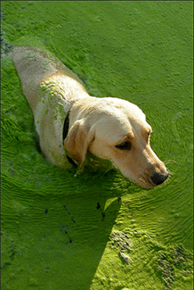
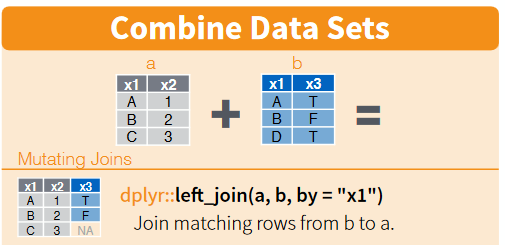

<style> code {color: #535353 !important;} </style>

```{r setup, include = F}
knitr::opts_chunk$set(echo = T, error = T, message = F, warning = F)

htmltools::tagList(rmarkdown::html_dependency_font_awesome())

dt_options <- list(scrollX = T, autoWidth = T, searching = F, ordering = F, lengthChange = F, paginate = F, info = F)
```


This path is all about connecting to Oracle databases like `TEMPO` and `Delta`.


# Sick dogs

A string of dog deaths has left public health officials scratching their heads. Are cats finally getting their revenge or is there some other funny business at play?

After a few days of chasing down dead-ends, you find a fax waiting for you in your office. The letterhead shows the logo for the Wisconsin DNR. That's odd. The last time you heard from them was during the great chameleon outbreak of 1992. 

The letter contains the following warning: 

{align="right" style="margin-left: 22px;" width="220"}

> Prepare yourselves!
>
> The deadly _Caninus-morbidium_ (CM) is believed to be headed your way.
> We've found that it likes warm water and low oxygen, but it really dislikes fish and fast moving water. 
> 
> According to our measurements we've seen them living in temperatures greater than 23 C, but less than 27 C.
> The dissolved oxygen range has been greater than 4, but less than 6.
>

<br><br>

__Which water bodies in MN would be hospitable to this bacteria?__


## TEMPO & Delta: _Oracle databases_ 

<br>

To get started you need to tell your computer where _Delta_ is.

1. Open the _Control Panel_ > _Administrative Tools_ > _Data Sources (ODBC)_
1. Click the __[Add...]__ button.
1. Driver Name: __Oracle in OraClient11g_home2__
1. Data Source Name: __deltaw__
1. TNS Service Name: __deltaw.pca.state.mn.us__

You can leave the rest blank. Click the __[Test Connection]__ button.

Enter the top secret __User Name:__ `t*********` and __Password:__ `d***_**`. 

_If you need a user name and password contact the Data Desk at [DataDesk.MPCA@state.mn.us](DataDesk.MPCA@state.mn.us)._

Once you get a `Connection successful!` message. You're all set. Close out and return to RStudio.

<br>

### Facility locations  

Let's find the location of some facilities.

<br>

You can view the available database connections in R using the function `odbcDataSources()`.
```{r}
library(dplyr)
library(RODBC)

odbcDataSources()

```


<br>

To connect to `deltaw` use the function `odbcConnect()`.

```{r, warning = F}
library(readr)

# Load credentials
credentials <- read_csv("X:/Agency_Files/Outcomes/Risk_Eval_Air_Mod/_Air_Risk_Evaluation/R/R_Camp/Student Folder/credentials.csv")

user      <- credentials$delta_user
password  <- credentials$delta_pwd

# Or use your own
#user      <- "ta*******"
#password  <- "da**_*******"
  
# Connect to Delta
deltaw <- odbcConnect("deltaw", 
                      uid = user, 
                      pwd = password,
                      believeNRows = FALSE)  


# View all schemas in deltaw
sqlTables(deltaw)$TABLE_SCHEM %>% unique() %>% sort()


# View the tables inside the Warehouse TEMPO schema
tbl_list_wh <- sqlTables(deltaw, schema = "WH_TEMPO")

# View the tables inside the real TEMPO
tbl_list <- sqlTables(deltaw, schema = "TEMPO")

# Let's find the MN chickens!
# Get the first 10 results in "MV_FEEDLOT"
feedlots  <- sqlQuery(deltaw, "SELECT * FROM WH_TEMPO.MV_FEEDLOT", 
                      max = 10,  # Row limit for data pull, start small
                      stringsAsFactors = F)
```

```{r, echo=F}
knitr::kable(feedlots[ , 1:6] %>% head())
```

<br>


__Now for some real TEMPO seriousness.__


## Get TEMPO Agency Interest names and IDs
```{r}
fac_ids   <- sqlFetch(deltaw, "TEMPO.AGENCY_INTEREST", max = 10000, stringsAsFactors = F)

glimpse(fac_ids)
```


## Get facility locations
```{r}
locations <- sqlFetch(deltaw, "TEMPO.SUBJ_ITEM_LOCATION", max = 10000, stringsAsFactors = F)
```

```{r, echo = F}
knitr::kable(head(locations[,1:6]))
```


## left_join()

[Go here](left_join_examples.html) for an introduction to `left_join()` using cats.


Now we're ready to `left_join()` our two tables together.



<br>

Using `left_join(table_A, table_B)` ensures that the result will contain all the rows and columns  in `table_A`. The values in the columns of `table_B` will only be joined to `table_A` when they have a value in common. In the case below, location results will only be joined to the _fac_ids_ table, when both tables contain a row of data with the same `MASTER_AI_ID`.


## Join locations to facilities using the Master AI ID
```{r}
fac_locs  <- left_join(fac_ids, locations, by = "MASTER_AI_ID")

# Show lat/long for facilities
select(fac_locs, MASTER_AI_ID, MASTER_AI_NAME, X_COORD_VALUE , Y_COORD_VALUE) %>% head(7)

```


<br>


### Pop Quiz, hotshot!

According to TEMPO, which Municipality is the facilty 'BrandFX LLC' located in?

<input type="radio"> _There is no `BrandFX LLC` facility._ <br> 
<input type="radio"> _Dunnell_   <br> 
<input type="radio"> _St. Louis_ <br> 
<input type="radio"> _Mahnomen_  <br>
<input type="radio"> _Walker_    <br>

<br>


<details>
<summary class = "btn_code">_Show solution_</summary>
<p>

<i class="fa fa-check" aria-hidden="true" style="color: green;"></i> `Dunnell` 

_You sure aren't kitten around! Great work!_

</p></details>

<br>


# Water data

## EQUIS | Water monitoring

```{r}

# View the tables inside the EQUIS schema
equis_tbls <- sqlTables(deltaw, schema = "EQUIS")

equis_tbls %>% head(11)

```

## Pull EQUIS surface water data
```{r}
library(ggplot2)

# Grab 5,000 rows from DT_WELL
eq_wells  <- sqlQuery(deltaw, paste0("SELECT * FROM EQUIS.DT_WELL"),
                        max = 5000,
                        stringsAsFactors = F, 
                        as.is = T)

# Histogram of well depths
eq_wells %>% ggplot(aes(x = as.numeric(DEPTH_OF_WELL))) + geom_histogram()

# Boxplot of depth by well purpose
eq_wells <- mutate(eq_wells, 
                     DEPTH_OF_WELL = as.numeric(eq_wells$DEPTH_OF_WELL),
                     WELL_PURPOSE  = as.factor(WELL_PURPOSE))

eq_wells %>% 
  ggplot(aes(x = WELL_PURPOSE, y = as.numeric(DEPTH_OF_WELL), fill = WELL_PURPOSE)) + 
    geom_boxplot() + scale_y_log10() + 
    theme_minimal()

# Close all open connections
odbcCloseAll() 
```


## You unlocked a shortcut! 

You discovered an EQUIS CSV file.

Read in the water temperature data using `read_csv()`.
```{r}
library(readr)

## CSV file location
filepath <- "X:/Agency_Files/Outcomes/Risk_Eval_Air_Mod/_Air_Risk_Evaluation/R/R_Camp/Student Folder/Sample data/surface_water_temp_2015_16.csv"

# This file is BIG!
sw <- read_csv(filepath)

# Show top rows
head(sw[ , 1:5])
```

<br>

You will see a few issues with this data. 

- There are location names missing. 
- There are results flagged as not detected. 
- There are a lot of excess columns we don't need. 

Let's use our favorite _dplyr_ functions to clean it up.
```{r, eval = F}
library(dplyr)

# Take a quick look
glimpse(sw)


# Get rid of missing locations
sw <- filter(sw, !is.na(LOC_NAME))


# Keep only the detected values
## Warning: This usually isn't a great idea, but we're in a hurry.
## Good practice would be to review missing values, and generate summaries that incorporate non-detect values.
sw <- filter(sw, DETECT_FLAG == "Y")


# Keep only *useful* columns
sw <- select(sw, LOC_NAME, SAMPLE_DATE, CHEMICAL_NAME, REPORT_RESULT_VALUE, REPORT_RESULT_UNIT)
```

## Let's compare temperature to dissolved oxygen

> All of the temperature and dissolved oxygen results are in the same column with the chemical name in a separate column. What if we want the dissolved oxygen and temparture results in separate columns? 

We can use the `spread()` function from the _tidyr_ package to do this. Let's install it!


`install.packages("tidyr")`


```{r, results = "hide", message = F, eval = F}
library(tidyr)

sw_wide <- spread(sw, CHEMICAL_NAME, REPORT_RESULT_VALUE) 

# Error!!! See below to resolve.
```

```{r, echo = F, message=F}
library(tidyr)
```

<br>

> We're getting an error because we have multiple observations (duplicates) for the exact same sampling time. Let's average the results taken at the same place and time.

```{r}
# Group by site, date, and chemical; and then average the observation
sw <- sw  %>% 
        group_by(LOC_NAME, SAMPLE_DATE, CHEMICAL_NAME, REPORT_RESULT_UNIT) %>% 
        summarize(REPORT_RESULT_VALUE = mean(REPORT_RESULT_VALUE, na.rm = T)) %>% 
        ungroup()

# Now let's try splitting the observation into 2 columns again.
sw_wide <- spread(sw, CHEMICAL_NAME, REPORT_RESULT_VALUE)

# Show table
head(sw_wide)

```


This looks great, `Temp` and `DO` are in separate columns, but something doesn't look right. The unit column is creating different rows for temp and DO, so let's remove the units column for now.

```{r}
# Drop units column
sw <- select(sw, -REPORT_RESULT_UNIT)

# Try the 3rd time, it'll be charmed
sw_wide <- spread(sw, CHEMICAL_NAME, REPORT_RESULT_VALUE)

head(sw_wide)
```


Things look good now, but the `DO` and `temp` column names have spaces in them. We can technically leave them this way, but they can create trouble for us later on. Let's use `names()` to tidy them.

```{r}
# Assign the table names as a list
names(sw_wide) <- c("location", "sample_date", "DO_mg_per_L", "temp_C")
```


## Now back to _KILLER_ bacteria

{width="350"}

>
> The deadly _Caninus-morbidium_ (CM) is believed to be headed your way.
> We've found that it likes warm water and low oxygen, but it really dislikes fish and fast moving water. 
> 
> According to our measurements we've seen them living in temperatures greater than 23 C, but less than 28 C.
> The dissolved oxygen range has been greater than 4, but less than 6.
>


__Which water bodies would be hospitable to this bacteria?__

<br>

Use `filter()` to find the water bodies that might be home to deadly _CM_.

<br>
```{r, eval = F}

bad_water <- filter(sw_wide)

```


```{r, eval = F, echo = F}

bad_water <- filter(sw_wide, 
                    temp_C > 23, temp_C < 28, 
                    DO_mg_per_L > 4, DO_mg_per_L < 6)

```

### Fast water

The function `grepl()` can be used to find the water bodies with "River" in their name.

```{r, eval = F}
bad_water$location

bad_water <- filter(bad_water, !grepl("River", location))


# Use tolower() to account for capitalization issues
bad_water <- filter(bad_water, !grepl("river", tolower(location)))

```


### Now let's plot the data for one of these water bodies over time.

Maybe we can find some clues that point to a water body becoming infected with _CM_.
```{r}

# This one is the best ditch
favorite_wb <-  "Judicial Ditch 2"

sw_fav <- filter(sw_wide, location == favorite_wb)
```

```{r, results = "hide", eval = F}
ggplot(sw_fav, aes(x = sample_date, y = DO_mg_per_L)) +
  geom_line() +
  scale_x_datetime() 

# ERROR! Nooo!!! See below to resolve.
```


> Uh oh, this doesn't work because our dates are character objects and are not date/time objects. What should we do now?

A) Give up. _(Return to top of page.)_  
B) Just keep trying the same script over and over again until it works.  _(Return to beginning of this sentence and read again.)_  
C) Scroll down to find a package that will change columns into datetime objects. _(Continue below.)_  

<br>


### Good choice!
Let's install _lubridate_ to fix our date problems.

 


`install.packages("lubridate")`

```{r}
library(lubridate)

# Convert sample_date to date object (something R knows is a date)
sw_fav <- mutate(sw_fav, sample_date = mdy_hms(sample_date))

# Try the plots again

# DO over time
ggplot(sw_fav, aes(x = sample_date, y = DO_mg_per_L)) +
  geom_line() +
  scale_x_datetime() +
  labs(title    = "DO over time at JD2",
       subtitle = "Yes, Judicial Ditch 2 is important",
       x = "Date of sample", 
       y = "Dissolved oxygen (mg/L)")

# Temperature over time
ggplot(sw_fav, aes(x = sample_date, y = temp_C)) +
  geom_line() +
  scale_x_datetime() +
  labs(title    = "Temp over time at JD2", 
       subtitle = "Judicial Ditch 2 is still important", 
       x = "Date of sample", 
       y = "Temp (in Celsius because Fahrenheit is stupid)")

# Temperature vs DO correlation
ggplot(sw_fav, aes(x = temp_C, y = DO_mg_per_L)) +
  geom_point() +
  labs(title    = "Temp vs. DO at JD2", 
       subtitle = "What is the relationship between temp and DO?", 
       x        = "Temp (in Celsius because Fahrenheit is so you know)", 
       y        = "Dissolved oxygen (mg/L)")

```

<br>


# Air data

## CEDR / Rapids | Air emissions inventory 

__CEDR__ is the one and only central air emissions data repository. It stores air emission data about all kinds of sources in Minnesota. 

```{r, eval = T}
library(RODBC)

# Connect to Delta
deltaw <- odbcConnect("deltaw", 
                      uid = user, 
                      pwd = password,
                      believeNRows = FALSE)  

# Show all tables in RAPIDS schema
rapids_tbls <- sqlTables(deltaw, tableType = "TABLE", schema = "RAPIDS")  


# Get inventory year code
inv_codes  <- sqlQuery(deltaw, "SELECT * FROM RAPIDS.INV_INVENTORIES", 
                       max = 100, 
                       stringsAsFactors = F)

# Get code for 2014
inv_id  <- filter(inv_codes, INVENTORY_YEAR == 2014)$RID

# Get emissions for inventory year
emissions   <- sqlQuery(deltaw, paste0("SELECT * FROM RAPIDS.INV_PROCESS_EMISSIONS WHERE INVENTORY_RID = ", inv_id),
                        max = 10000, 
                        stringsAsFactors = F, 
                        as.is = T)

# Additional SQL query options for emissions 
##" AND MATERIAL_CODE = 'CO2'",
##" AND PROCESS_RID = '101276120'"),


# Get emission units
e_units  <- sqlQuery(deltaw, paste0("SELECT * FROM RAPIDS.INV_EMISSION_UNITS WHERE INVENTORY_RID = ", inv_id), 
                        max = 10000, 
                        stringsAsFactors = F, 
                        as.is = T)


# Get emission processes
e_process  <- sqlQuery(deltaw, paste0("SELECT * FROM RAPIDS.INV_PROCESSeS WHERE INVENTORY_RID = ", inv_id), 
                        max = 10000, 
                        stringsAsFactors = F, 
                        as.is = T)


# Get SCC reference code description
scc   <- sqlQuery(deltaw, paste0("SELECT * FROM RAPIDS.REF_SCC_CODES"),
                  stringsAsFactors = F, 
                  as.is = T)


# Join SCC code EI sector to source params
e_process <- left_join(e_process, select(scc, SCC_CODE, EI_SECTOR))

# Convert SCC code to type character with as.character()
e_process <- mutate(e_process, SCC_CODE = as.character(SCC_CODE))

# Try to join again
e_process <- left_join(e_process, select(scc, SCC_CODE, EI_SECTOR))


# Check if EI_SECTOR column added to end of table
glimpse(e_process)


```


# Microsoft Access

1. Your Microsoft drivers are old and only work in old school "32-bit" mode.
    - To switch to _32-bit_ hipster mode, go to _Tools_ > _Global Options..._
    - At the top next to "R version:", select _Change..._
    - Choose the _32-bit_ version of R and click _OK._
    - __Close R__ by clicking the big red X, or pressing ` CTRL + Q `.
    - Reopen your project.
1. Now we can tell R the path to the Access db and the table name or view that we want to import from Access.
1. We pull in the movie data if it is not already in our environment.
1. Then we `left_join()` to the movie dataset to see which movies were released in the year of our births.

```{r, eval = F}
library(RODBC)   # For Access
library(readxl)  # For Excel
library(dplyr)   # For left_join
library(stringr) # For cleaning text data with garbage and spaces

db_path <- "X:/Agency_Files/Outcomes/Risk_Eval_Air_Mod/_Air_Risk_Evaluation/R/R_Camp/Student Folder/Sample data/Varietal Data.accdb"

table_name <- "Academy_awards"

bigdb <- odbcConnectAccess2007(db_path)

academy_awards <- sqlFetch(bigdb, table_name, 
                           rownames = F, 
                           stringsAsFactors = F)

odbcClose(bigdb) 


# Filter to only the best picture award category
academy_awards <- filter(academy_awards, Category == "Best Picture")


# Pull in movie data if it is not in your environment.
movies <- read_excel("X:/Agency_Files/Outcomes/Risk_Eval_Air_Mod/_Air_Risk_Evaluation/R/R_Camp/Student Folder/Sample data/IMDB movie data.xlsx", sheet = "use_this", skip = 2)

# Check movie titles
movies$movie_title %>% head()
```


## left_join()

Now we're ready to `left_join()` our two tables together.


<br>

```{r, eval = F}
# Join the award nominations to the movies data table
awards_movies <- left_join(movies, academy_awards, by = c("movie_title" = "Nominee"))

# Select only rows that successfully joined and added a value to the Won? column
winning_movies <- filter(awards_movies, !is.na(`Won?`))
```


## Find the director with the most wins
```{r, fig.width=11, eval = F}
library(ggplot2)

# group_by() director name to count the number of times their name appears
top_directors <- group_by(winning_movies, director_name) %>% 
                   summarize(award_count = n()) %>% 
                   arrange(desc(award_count))

# Column plot of top 12
ggplot(top_directors[1:10, ], aes(director_name, award_count)) + geom_col() + scale_color_brewer()

```


## When you're done

- Switch your R version back to 64-bit in __Tools__ > __Global options__. 
- Close RStudio and re-open your project.

<br>


_You've reached the end of this path. Return to the homepage and continue searching._

