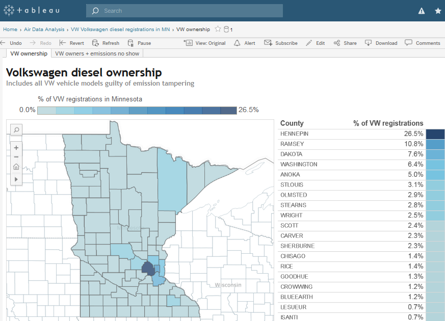

<style> code {color: #535353 !important;} </style>

```{r setup, include = F}
knitr::opts_chunk$set(echo = T, error = T, message = F, warning = F)
htmltools::tagList(rmarkdown::html_dependency_font_awesome())
dt_options <- list(scrollX = T, autoWidth = T, searching = F, ordering = F, lengthChange = F, paginate = F, info = F)
```




<br>

I'll let you in on my best known secret. You can grab data directly from published Tableau workbooks without even opening them. This is handy when you don't have access to an underlying database or when you're dealing with a database that requires complicated table joins to extract the data you need. 

<br>

__Here's the trick:__

> To download data from a Tableau workbook add ".csv" to the end of a worksheet's _URL_. 
>
> Let's try it!


# Bad Volkswagen data

Let's the grab the data behind the internal [Volkswagen vehicle](http://tableau.pca.state.mn.us/#/views/VWVolkswagendieselregistrationsinMN/VWownership) workbook.


```{r }
library(readr)

# MPCA Tableau site
pca_tableau <- "http://tableau.pca.state.mn.us/views/"


# Tableau worksheet URL
## Delete the link garbage
## Remove the "/#/" in the middle and the question mark at the end w/ anything that comes after
workbook    <- "Volkswagenownership/VWownership"


# Complete URL
tableau_url <- paste0(pca_tableau, workbook)


# Final URL will look like this
tableau_url <- "http://tableau.pca.state.mn.us/views/VWVolkswagendieselregistrationsinMN/VWownership"


# Paste ".csv" to end of Tableau URL
tableau_url <- paste0(tableau_url, ".csv")

# Read data into a data frame
vw_cars <- read_csv(tableau_url)

# Take a look
head(vw_cars)
```

<br>

Isn't that great? But there is one small caveat.

- This trick doesn't work on the URL of a Tableau _Story_. You'll need to get to the worksheet or dashboard behind the story.
 
As an example, take a look at the [Watershed Pollutant Load Monitoring](http://tableau.pca.state.mn.us/#/views/wplmn_data_browser/WPLMNBrowser) workbook. Since the workbook loads to a _Story_ the nifty `.csv` trick won't work on this page. We need to jump over to a worksheet or dashboard behind the story. 

In this case the tabs are shown at the top, but this won't always be true. Let's try the tab _"Download Annual data"_.


## Grab watershed data

Now that you know the name of the worksheet, the data is free for the taking. Let's read it into R.
```{r }
library(readr)


# MPCA Tableau site
pca_tableau <- "http://tableau.pca.state.mn.us/views/"

# Tableau workbook 
workbook    <- "wplmn_data_browser/DownloadAnnualData"

# Complete URL
tableau_url <- paste0(pca_tableau, workbook)


# Paste ".csv" to end of Tableau URL
tableau_url <- paste0(tableau_url, ".csv")

# Read data into a data frame
water <- read_csv(tableau_url)

# How many rows are there?
nrow(water)

# Take a look
head(water)
```

<br>

Wow! There's over __4,000__ rows of data. It looks like we got __ALL__ the data. That's because everything is selected in the filters on the right. If you'd like to download data for only a single site or a single year, you can change the filter by adding a little magic to the end of the URL.


<br>

## Requesting filtered data

The filters on the worksheet are accessible by using the format ` Year=2014 `. To add a filter to your data request you first add a `?` to the end of the workseet URL and then the filter. The final URL with the 2014 year filter would look like this `http://tableau.pca.state.mn.us/views/wplmn_data_browser/DownloadAnnualData.csv?Year=2014`.

Let's get all the data for year 2014.
```{r }
library(readr)

# MPCA Tableau site
pca_tableau <- "http://tableau.pca.state.mn.us/views/"

# Tableau worksheet
workbook    <- "wplmn_data_browser/DownloadAnnualData"

# Complete URL
tableau_url <- paste0(pca_tableau, workbook)

  
# Paste ".csv" to end of Tableau URL
tableau_url <- paste0(tableau_url, ".csv")

# Add the Year=2014 filter
tableau_url <- paste0(tableau_url, "?Year=2014")

# Read data into a data frame
water_2014 <- read_csv(tableau_url)

# Take a look
head(water_2014)
```

<br> 


Perfect! Were down to only __926__ rows of data.


## Filtering with special characters

Want to try one of the other filters? Things can get a little trickier when you filter on values that contain special characters, such as text with spaces - _"Total phosphorous"_ - or slashes - _"FWMC (mg/L)"_ -. To filter with special characters in a URL you'll need to let the browser know that you really mean a text slash "/", and that you don't mean "move up a folder" as in `Desktop/Documents/Reports`. To do this, URL's have codes for the characters that usually mean something else to computers. For example, the forward slash _"/"_ has the special code `%2`. A space has the code `%20`. 

Here is a table of codes for the most common symbols. A more complete reference and a tool to convert your text to a URL friendly format is online [here](https://www.w3schools.com/tags/ref_urlencode.asp).


```{r, eval=T, echo=F, message=F, warning=F, fig.width=4}
library(dplyr)

codes <- data_frame('space' = '%20',
                    '\"'    = '%23',
                    '%'     = '%25',
                    '-'     = '%2D',
                    '.'     = '%2E',
                    '<'     = '%3C',
                    '>'     = '%3E',
                    '\\'    = '%5C',
                    '/'     = '%2F',
                    '^'     = '%5E',
                    '_'     = '%5F',
                    '\`'    = '%60',
                    '{'     = '%7B',
                    '|'     = '%7C',
                    '}'     = '%7D',
                    '~'     = '%7E')
                    

DT::datatable(codes, options = dt_options, rownames = FALSE)

#| space | \" | % 	| - | . | < |	> |	\\\ |	/ | ^ |	_ |	\` | \{ |	\| | \} |	~ |
#|-------|----|----|---|---|---|---|-----|---|---|---|----|----|----|----|---|
#| %20 |	%22 |	%25 |	%2D |	%2E |	%3C |	%3E |	%5C | %2F |	%5E |	%5F |	%60 |	%7B | %7C |	%7D | %7E |
```

<br>

Let's try filtering the data to one the values listed for `Parameter`. If the filter doesn't work, Tableau will be nice and send you all of the data. However, it isn't helpful enough to give you clues about what's wrong with your filter. Like if I happen to misspell _phosphourus_ 3 times. 

The code below filters the data to the `Parameter` _Total phosphorus_.
```{r }
library(readr)

# MPCA Tableau site
pca_tableau <- "http://tableau.pca.state.mn.us/views/"

# Tableau worksheet
workbook    <- "wplmn_data_browser/DownloadAnnualData"

# Complete URL
tableau_url <- paste0(pca_tableau, workbook)


# Paste ".csv" to end of Tableau URL
tableau_url <- paste0(tableau_url, ".csv")

# Add the Measures="Mass+(kg)" filter
tableau_url <- paste0(tableau_url, "?Parameter=Total%20phosphorus")

# Read data into a data frame
water_phos <- read_csv(tableau_url)

# Take a look
head(water_phos, 5)
```

<br> 

Try filtering the sites to only the `Hydstra ID` _W38014001_.
```{r }
library(readr)

#Tableau worksheet URL
tableau_url <- "http://tableau.pca.state.mn.us/views/wplmn_data_browser/DownloadAnnualData"

# Paste ".csv" to end of Tableau URL
tableau_url <- paste0(tableau_url, ".csv")

# Add the Measures="Mass+(kg)" filter
tableau_url <- paste0(tableau_url, "?Hydstra%20ID=W38014001")

# Read data into a data frame
water_missip <- read_csv(tableau_url)

# Take a look
head(water_missip, 5)
```

<br>

Simple site IDs are your friend. Dashes, slashes, and surprising capital letters are not.


### A Happy note!
To add multiple filters, separate them with the `&` character with no spaces. As in `?Year=2014&Parameter=Flow`.

### Sad note /#1

> If the author of the worksheet hasn't added the filter to the page, you won't be able to use it in a magic URL.


### Sad note /#2

> If the workbook author has all of its worksheets and dashboards hidden, you won't be able to access its data using the ".csv" trick. Contact the workbook author and politley request that they unhide one of their data tabs so you can more easily steal the data.


```{r, eval = F, echo = F}

## Hidden tabs

Sometimes tabs are hidden.

1. Download and open the workbook to find the name of the worksheet with the data you want.
1. Click `Share` on the bottom of the Tableau public page and copy the lower link. Paste this URL into your browser and then scroll all the way to the bottom of the page. You should see a section on the right called __Metadata:__. These are all the names of the hidden tabs. You can even open them by clicking one of them. 


Let's try downloading data from the tab _"Point Source Summary Data Table"_.


Now that you know the name of the worksheet, let's read it into R.
#--- {r }

#Tableau worksheet URL
tableau_url <- "https://public.tableau.com/views/Pointsourceairemissionsdata/MPCA_PointSource_SummaryData"

# Add ".csv?:embed=y" to Tableau URL
tableau_url <- paste0(tableau_url, ".csv?:embed=y")

fac_emits <- read_csv(tableau_url)

head(fac_emits)


<br>

The filters on the worksheet are accessible by using the format`Year=2014`. To add a filter to your data request you need to add a `?` to the end of the workseet URL. Your final URL will look like this 

https://public.tableau.com/profile/mpca.data.services#!/vizhome/Pointsourceairemissionsdata/EmissionsbyFacility.csv?:embed=y&Year=2014
```

<br><br><br>


__Congratulations! You found a shiny treasure. _But_ you're greedy. Return to the top of the page and keep hunting.__

