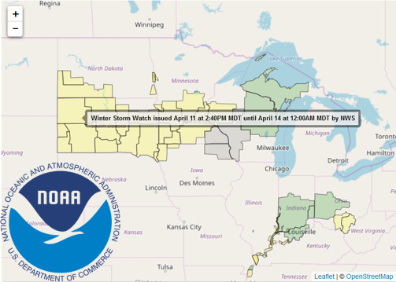

<style> code {color: #535353 !important;} </style>

```{r setup, include = F}
knitr::opts_chunk$set(echo = T, error = T, message = F, warning = F)
htmltools::tagList(rmarkdown::html_dependency_font_awesome())
dt_options <- list(scrollX = T, autoWidth = T, searching = F, ordering = F, lengthChange = F, paginate = F, info = F)
```



This path includes examples of downloading online data from FTP sites and other data stores.


# EPA's _AirNow_

Air data for the _entire_ United States is at your finger tips. _AirNow_ maintains a publicly accessible folder of current air monitoring data at [Today's air quality](https://files.airnowtech.org/).

Use the following code to grab the most recent AQI results for the United States.

### Get air monitoring data
```{r }
library(dplyr)
library(readr)

# Connect to AirNow data site
airnow_link <- paste0("https://s3-us-west-1.amazonaws.com//files.airnowtech.org/airnow/today/HourlyData_",
                      format(Sys.time() -60*75, "%Y%m%d%H", tz = "GMT"), #Subtracts one hour from current hour
                      ".dat")
  
# Read a "|" delimited file that has no column names (Thanks EPA!)
aqi_now   <- read_delim(airnow_link, "|", col_names = F)
                        
 
# Add column names as a list
names(aqi_now) <- c("date", "time", "aqsid", "city", "local_time", "parameter", "units", "concentration", "agency")


# Filter to Ozone and PM2.5 results
aqi_now <- filter(aqi_now, parameter %in% c("OZONE", "PM2.5"))


# Show table of top concentration results
aqi_now %>% arrange(desc(concentration)) %>% select(-time, -aqsid, -units) %>% head(10)
 
```


### Get monitoring locations

The air monitoring locations can be accessed from _AirNow_ as well.
```{r }
# Connect to AirNow data site
airnow_link <- "https://s3-us-west-1.amazonaws.com//files.airnowtech.org/airnow/today/monitoring_site_locations.dat"

# Read a pipe (|) delimited file  
aqi_sites   <- read_delim(airnow_link, "|", col_names = F)

# Drop empty columns
aqi_sites <- aqi_sites[ , -c(14:16,22:23)]


# Add column names
names(aqi_sites) <- c("aqsid", 
                      "parameter", 
                      "local_id", 
                      "name", 
                      "status", 
                      "state_region", 
                      "agency", 
                      "epa_region", 
                      "lat", 
                      "long", 
                      "elevation",
                      "local_time",
                      "country",
                      "city",
                      "state_fips",
                      "state",
                      "county_fips",
                      "county")

# Drop the parameter column and take *unique* rows
aqi_sites <- aqi_sites %>% select(-parameter) %>% unique()
                  
```


### Join tables and map PM2.5 concentrations
```{r, fig.width=12, fig.height=6.5}
library(ggplot2)
library(viridis)


# Add site locations to monitoring data
aqi_now <- left_join(aqi_now, aqi_sites, by = "aqsid")


# Plot map of sites for PM2.5
filter(aqi_now, parameter == "PM2.5", !is.na(lat)) %>%
  ggplot(aes(x = long, y = lat)) + 
    geom_point(aes(color = concentration), size = 3, alpha = 0.6) + 
    scale_color_viridis() 

```


### Map Minnesota
```{r, fig.width=8, fig.height=6.6}
library(ggplot2)
library(viridis)

# Filter to Minnesota
aqi_mn <- filter(aqi_now, state == "MN")

# Plot map of sites for PM2.5
filter(aqi_mn, parameter == "PM2.5") %>%
  ggplot(aes(x = long, y = lat)) + 
    geom_point(aes(color = concentration), size = 6, alpha = 0.6) + 
    geom_label(aes(label = concentration), hjust = 1.4) + 
    scale_color_viridis() 


```


# Weather alerts

The script below will make a map of the current weather alerts in the Midwest. _Hint: You will need to install new packages._

Install the latest version of _weatherAlerts_ with:

```{r, eval = F}

install.packages("devtools")`  

devtools::install_github("ianmcook/weatherAlerts")  

devtools::install_github("ianmcook/weatherAlertAreas")
```

<br>

```{r}
library(tidyverse)
library(weatherAlerts)
library(weatherAlertAreas)
library(leaflet)

alerts <- getAlerts(includeStates = c("MN", "WI", "ND", "SD", "IA", "MI", "IL", "IN", "OH", "MO", "FL")) # takes about 20 seconds

# Save alert severity to a list
severity <- alerts@data$severity

# Assign alerts a color based on severity ranking
colorMap <- c(Minor    = "green",
              Moderate = "yellow",
              Severe   = "red",
              Extreme  = "magenta",
              Unknown  = "grey")

severityColors <- unname(colorMap[severity])

leaflet() %>%
  addProviderTiles(providers$OpenStreetMap) %>%
  addPolygons(data = alerts, 
              fillColor = severityColors,
              color = "black", # Border color
              weight = 1,
              label = ~title)

# Hover for alert information.
``` 


<br>

_Return to the top of the page._


